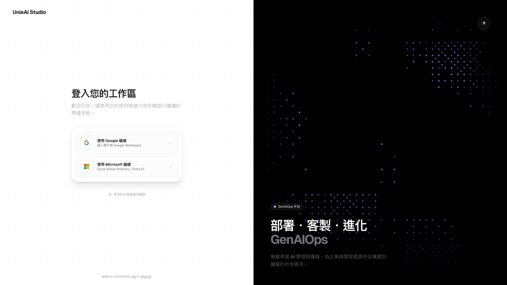
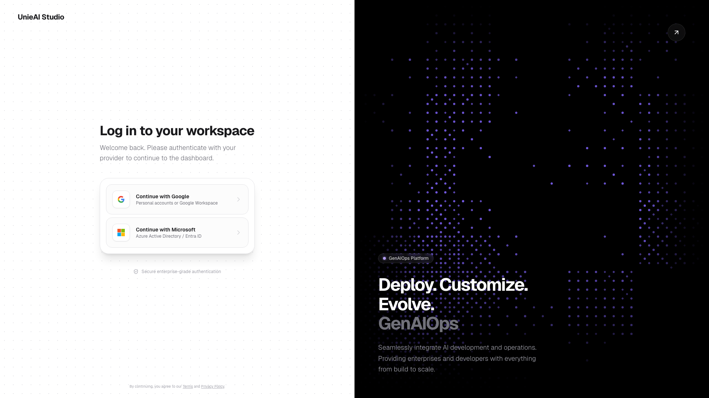
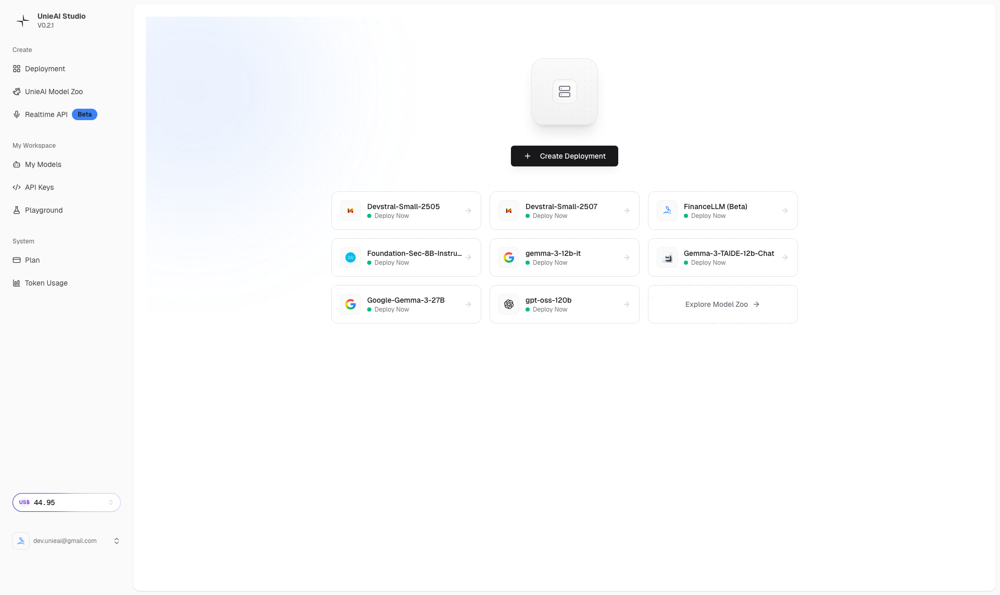
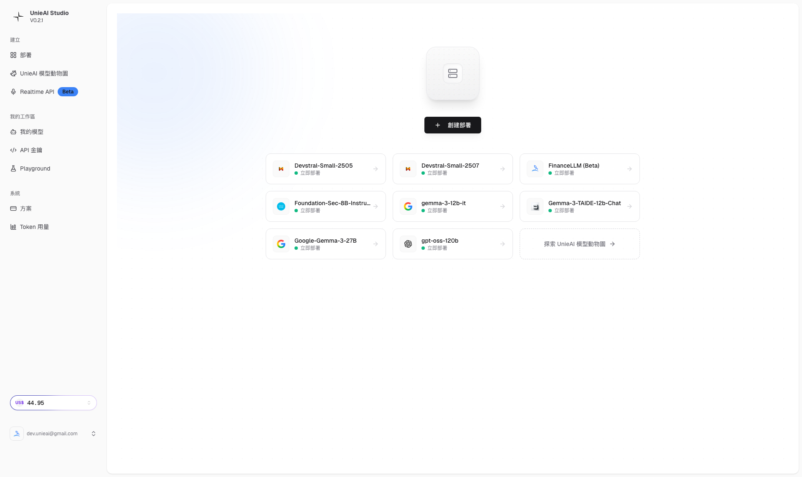

# UnieAI Studio 教學 - 第一章：基礎登入與導航

*🎯 零基礎必讀：掌握 UnieAI Studio 的開始步驟*

---

## 📋 本章學習目標

完成本章後，你將能夠：
- ✅ 成功訪問和登入 UnieAI Studio
- ✅ 理解平台的基本導航結構  
- ✅ 熟悉 Dashboard 界面
- ✅ 識別所有主要功能入口
- ✅ 完成平台的基本導航測試

**⏱️ 預估完成時間**: 15-20 分鐘  
**🎯 難度**: 零基礎

---

## 🚀 第一節：平台介紹

### 🌟 什麼是 UnieAI Studio？

UnieAI Studio 是一個專業的 AI 開發平台，提供：
- 🤖 **106+ 個 AI 模型** 可供選擇
- 🎮 **專業 Playground 測試環境** 
- 🚀 **模型部署和 API 管理**
- ⚡ **Realtime API 即時測試**
- 💰 **透明計費和成本控制**

### 💡 平台價值
```
🎯 為什麼選擇 UnieAI Studio?
✅ 多模型選擇 - 從通用對話到專業任務
✅ 專業工具 - Playground 和 Realtime API
✅ 開發友好 - 完整的 API 生態系統
✅ 成本透明 - 清楚的計費和監控
✅ 中文支援 - 繁體中文界面
```

---

## 🔐 第二節：登入步驟

### 📍 步驟 1：訪問平台
```bash
🌐 網址: https://studio.unieai.com
📱 建議瀏覽器: Chrome/Firefox/Safari (最新版本)
💻 設備要求: 電腦或平板 (手機可瀏覽，功能較受限)
```

### 🔑 步驟 2：OAuth 認證

#### 支援的認證方式
```
🔐 支援的登入方式:
• Google 帳號登入
• Microsoft 帳號登入
• 企業 SSO (如適用)
```

#### 登入流程
```
📝 Step-by-Step 登入:
1. 訪問 https://studio.unieai.com
2. 點擊 "登入" 或 "Login" 按鈕
3. 選擇 Google 或 Microsoft
4. 在相應平台完成身份驗證
5. 返回 UnieAI Studio
6. 確認進入 Dashboard
```

### 📸 登入前界面展示

#### 登入前頁面
  
*登入前：顯示平台介紹和登入選項*

**界面元素說明**：
- **主標題**: UnieAI Studio 品牌標識
- **登入按鈕**: 主要的行動號召
- **功能介紹**: 平台特色和價值說明
- **支援連結**: 幫助文檔和支援資源

#### OAuth 登入頁面
  
*OAuth 登入：選擇 Google 或 Microsoft 身份驗證*

**選項說明**：
- **Google 登入**: 使用 Google 帳號快速登入
- **Microsoft 登入**: 使用 Microsoft 帳號登入
- **建議**: 選擇你日常使用的帳號

---

## 🏠 第三節：Dashboard 界面導覽

### ✅ 登入成功確認

登入成功後，你應該看到：
```
🎯 成功指標:
□ URL 顯示 https://studio.unieai.com (或 zh-TW)
□ 右上角顯示用戶名稱或頭像
□ 主要功能按鈕可見 ("創建部署" 等)
□ 繁體中文界面載入完成
□ 頁面沒有錯誤訊息
```

### 📱 Dashboard 界面分析

#### 登入後 Dashboard
  
*登入後 Dashboard：繁體中文主界面*

**主要界面元素**：
1. **頂部導航欄**
   - Logo 和品牌標識
   - 用戶資訊 (右上角)
   - 語言選擇 (如有)

2. **側邊欄導航**
   - Dashboard (主要控制面板)
   - UnieAI 模型動物園
   - 我的模型
   - 創建部署
   - API 金鑰
   - Realtime API
   - 計費資訊

3. **主要內容區**
   - 歡迎訊息
   - 快速操作按鈕
   - 最近活動或建議

#### 認證後基線界面
  
*認證後基線：完整的平台界面結構*

### 🧭 導航結構說明

#### 主要功能入口
```
📋 導航項目說明:
• Dashboard - 控制面板和總覽
• UnieAI 模型動物園 - 瀏覽可用模型
• 我的模型 - 管理已部署模型
• 創建部署 - 部署新模型 ⭐重點
• API 金鑰 - 管理 API 存取權限
• Realtime API - 即時測試工具
• 計費資訊 - 成本監控
```

#### 功能優先級建議
```
🎯 新手建議學習順序:
1. 首先熟悉 Dashboard
2. 探索 Model Zoo 了解模型
3. 嘗試 Playground 進行測試
4. 學習創建部署
5. 管理 API 金鑰
6. 使用 Realtime API
```

---

## 🛠️ 第四節：實戰練習

### ✅ 練習項目

完成以下練習項目來確認你的理解：

#### 練習 1：登入驗證
```
□ 成功訪問 https://studio.unieai.com
□ 完成 OAuth 認證登入
□ 確認進入繁體中文界面
□ 檢查 URL 是否為 studio.unieai.com
□ 確認右上角顯示用戶資訊
```

#### 練習 2：界面熟悉
```
□ 識別頂部導航欄元素
□ 查看側邊欄所有導航項目
□ 確認 "創建部署" 按鈕可見
□ 檢查是否有計費資訊顯示
□ 測試頁面載入速度
```

#### 練習 3：基礎導航
```
□ 點擊 "Dashboard" 確認頁面切換
□ 嘗試點擊 "UnieAI 模型動物園"
□ 訪問 "我的模型" 頁面
□ 查看 "API 金鑰" 管理界面
□ 探索 "Realtime API" 功能
```

#### 練習 4：功能識別
```
□ 找到 "創建部署" 主要入口
□ 確認模型相關功能可用
□ 識別 API 管理工具
□ 查看成本監控功能
□ 檢查是否有幫助文檔連結
```

### 🔍 問題診斷

如果遇到問題，可以這樣檢查：

#### 常見登入問題
```
❌ 問題: 無法訪問網站
💡 解決: 檢查網路連接，嘗試清除瀏覽器快取

❌ 問題: OAuth 登入失敗
💡 解決: 確認網路穩定，重新嘗試認證

❌ 問題: 頁面載入緩慢
💡 解決: 等待頁面完全載入，檢查瀏覽器版本

❌ 問題: 界面不是中文
💡 解決: 檢查瀏覽器語言設定，確認平台支援
```

#### 界面問題
```
❌ 問題: 功能按鈕無法點擊
💡 解決: 確認登入狀態，刷新頁面重試

❌ 問題: 頁面顯示錯誤
💡 解決: 清除瀏覽器快取，重新登入

❌ 問題: 導航項目缺失
💡 解決: 檢查帳戶權限，聯繫支援
```

---

## 📚 第五節：下一步學習

### 🎯 準備進入下一章

完成本章練習後，你應該已經：
- ✅ 成功登入 UnieAI Studio
- ✅ 熟悉平台的基本界面
- ✅ 理解導航結構
- ✅ 識別主要功能入口

### 📖 下一章預覽

**第二章：模型探索與選擇**
- Model Zoo 功能詳細介紹
- 106+ 個模型的瀏覽方法
- FinanceLLM (Beta) 等具體模型分析
- 模型選擇策略和最佳實踐

### 💡 學習建議

```
🎯 學習建議:
• 按照章節順序學習效果最佳
• 每章的實戰練習都要完成
• 可以根據自己的背景跳過部分內容
• 遇到問題及時查看故障排除指南
• 加入社群與其他學習者交流
```

---

## ✅ 本章檢查清單

完成本章學習後，請確認：

```
📋 基礎登入與導航檢查清單:
□ 成功訪問 UnieAI Studio 平台
□ 完成 Google 或 Microsoft OAuth 登入
□ 確認進入繁體中文界面
□ 熟悉 Dashboard 界面結構
□ 識別側邊欄所有導航項目
□ 找到 "創建部署" 主要功能入口
□ 完成所有實戰練習項目
□ 理解導航結構和功能分類
□ 準備進入第二章學習
```

---

## 📞 獲得幫助

如果在本章學習過程中遇到問題：

### 🆘 支援資源
```
💬 獲得幫助:
• 查看第10章故障排除指南
• 訪問官方幫助文檔
• 聯繫技術支援團隊
• 參與社群討論
```

### 💡 學習技巧
```
🎯 學習成功技巧:
• 仔細閱讀每個步驟說明
• 截圖保存重要的界面狀態
• 完成所有實戰練習
• 不要跳過故障排除建議
• 保持學習的連續性
```

---

**🎊 恭喜完成第一章學習！你已經成功掌握了 UnieAI Studio 的基礎登入和導航。**

**準備好進入第二章：模型探索與選擇**

---

**由 DotDot Max ✨ 編撰**  
*零基礎必讀的 UnieAI Studio 入門指南 | 2026-01-29*