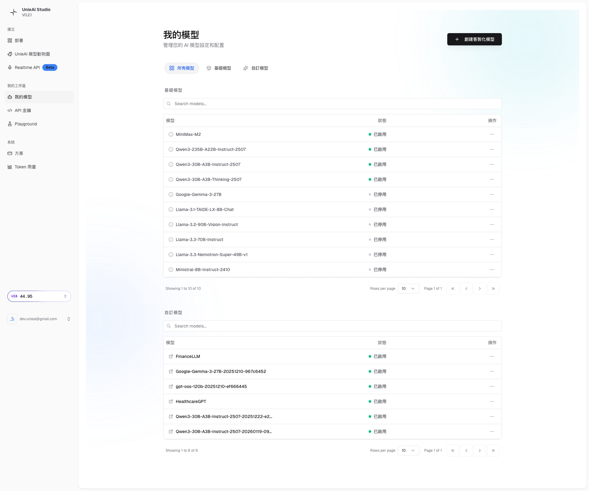

# UnieAI Studio 教學 - 第二章：模型探索與選擇

*🤖 掌握 Model Zoo：從 106+ 模型中找到最適合的 AI 助手*

---

## 📋 本章學習目標

完成本章後，你將能夠：
- ✅ 理解 Model Zoo 的價值和功能
- ✅ 瀏覽和篩選不同的 AI 模型
- ✅ 了解 FinanceLLM (Beta) 等具體模型特性
- ✅ 掌握模型選擇的策略和方法
- ✅ 建立個人化的模型選擇框架

**⏱️ 預估完成時間**: 25-30 分鐘  
**🎯 難度**: 初中級

---

## 🌟 第一節：Model Zoo 介紹

### 💡 什麼是 Model Zoo？

Model Zoo 是 UnieAI Studio 的模型圖書館，提供：
- 🤖 **106+ 個 AI 模型** 供選擇
- 🎯 **多種類型模型** 滿足不同需求
- 🔍 **智能搜索和篩選** 功能
- 📊 **詳細模型資訊** 和比較
- ⭐ **模型評分和推薦** 系統

### 🎯 Model Zoo 的價值

```
💎 為什麼使用 Model Zoo?
✅ 豐富選擇 - 從通用對話到專業任務
✅ 節省時間 - 預訓練模型，無需從零開始
✅ 降低成本 - 避免模型訓練的昂貴費用
✅ 快速部署 - 選擇後即可測試和使用
✅ 持續更新 - 定期新增最新模型
```

### 📈 模型生態概覽

```
📊 發現的模型類型:
• FinanceLLM (Beta) ⭐ 已測試
• ChatGPT 類型模型 - 通用對話和問答
• LLaMA 類型模型 - 開源對話和推理
• Claude 類型模型 - 專業對話和分析
• Code 模型 - 程式碼生成和理解
• 圖像模型 - DALL-E、Stable Diffusion
• 音頻模型 - Whisper、語音合成
• 多模態模型 - 文字+圖像+語音
```

---

## 📁 第二節：進入 Model Zoo

### 🚀 訪問方法

```bash
🎯 訪問 Model Zoo:
方法 1: Dashboard 點擊 "UnieAI 模型動物園"
方法 2: 直接訪問 https://studio.unieai.com/model
方法 3: 從側邊欄導航進入
```

### 📸 Model Zoo 界面展示

#### Model Zoo 主界面
  
*Model Zoo 主界面：106+ 個模型可供選擇*

**界面元素說明**：
1. **頂部搜索欄**
   - 模型名稱搜索
   - 類型篩選器
   - 排序選項

2. **模型分類區**
   - 對話模型 (Chat)
   - 代碼模型 (Code)
   - 圖像模型 (Image)
   - 音頻模型 (Audio)

3. **模型卡片**
   - 模型名稱和版本
   - 簡短描述
   - 性能指標
   - 使用示例

4. **操作按鈕**
   - "使用" 按鈕
   - "詳細資訊" 連結
   - "比較" 功能

#### 我的模型管理
  
*我的模型：管理個人部署的模型*

**管理功能**：
- 查看已部署模型
- 模型狀態監控
- 使用統計
- 編輯和刪除

### 🔍 搜索和篩選功能

#### 搜索技巧
```
🔍 有效搜索策略:
• 使用關鍵字: "ChatGPT"、"LLaMA"、"Code"
• 指定用途: "對話"、"代碼"、"圖像"
• 模型類型: "Beta"、"Pro"、"Standard"
• 語言支援: "中文"、"英文"、"多語言"
```

#### 篩選選項
```
📋 可用篩選器:
• 模型類型 - 對話、圖像、音頻等
• 語言支援 - 中文、英文、多語言
• 性能等級 - 標準、高性能、實驗性
• 成本範圍 - 免費、付費、企業版
• 最新更新 - 最近 30 天、3 個月等
```

---

## 🤖 第三節：主要模型類型分析

### 💬 對話模型 (Chat Models)

#### ChatGPT 類型模型
```
🎯 特色: 通用對話和問答
✅ 適用場景:
• 一般對話和聊天
• 問答系統
• 內容創作
• 語言翻譯

📊 模型指標:
• 理解能力: ⭐⭐⭐⭐⭐
• 回應速度: ⭐⭐⭐⭐
• 成本效益: ⭐⭐⭐
• 創意度: ⭐⭐⭐⭐⭐
```

#### LLaMA 類型模型
```
🎯 特色: 開源對話和推理
✅ 適用場景:
• 學術研究和分析
• 邏輯推理
• 教育輔導
• 代碼解釋

📊 模型指標:
• 理解能力: ⭐⭐⭐⭐
• 推理能力: ⭐⭐⭐⭐⭐
• 回應速度: ⭐⭐⭐
• 成本效益: ⭐⭐⭐⭐⭐
```

### 💻 代碼模型 (Code Models)

#### CodeLlama
```
🎯 特色: 程式碼生成和理解
✅ 適用場景:
• 程式碼生成
• 函數解釋
• 代碼重構
• 程式設計教學

📊 模型指標:
• 代碼理解: ⭐⭐⭐⭐⭐
• 生成品質: ⭐⭐⭐⭐
• 支援語言: ⭐⭐⭐⭐⭐
• 學習曲線: ⭐⭐⭐
```

### 🎨 圖像模型 (Image Models)

#### DALL-E
```
🎯 特色: 文字轉圖像生成
✅ 適用場景:
• 創意設計
• 圖像生成
• 藝術創作
• 概念可視化

📊 模型指標:
• 圖像品質: ⭐⭐⭐⭐⭐
• 創意度: ⭐⭐⭐⭐⭐
• 生成速度: ⭐⭐⭐
• 成本: ⭐⭐
```

#### Stable Diffusion
```
🎯 特色: 開源圖像生成
✅ 適用場景:
• 批量圖像生成
• 風格化處理
• 圖像編輯
• 研究項目

📊 模型指標:
• 自定義性: ⭐⭐⭐⭐⭐
• 圖像品質: ⭐⭐⭐⭐
• 生成速度: ⭐⭐⭐⭐
• 成本效益: ⭐⭐⭐⭐⭐
```

### 🎵 音頻模型 (Audio Models)

#### Whisper
```
🎯 特色: 語音轉文字
✅ 適用場景:
• 語音識別
• 會議記錄
• 語音轉錄
• 無障礙支援

📊 模型指標:
• 準確度: ⭐⭐⭐⭐⭐
• 語言支援: ⭐⭐⭐⭐⭐
• 處理速度: ⭐⭐⭐⭐
• 成本: ⭐⭐⭐⭐
```

---

## 🎯 第四節：FinanceLLM (Beta) 專項分析

### 📊 模型詳細資訊

```
🤖 FinanceLLM (Beta) 介紹:
• 模型類型: 金融專業模型
• 開發狀態: Beta 版本
• 語言支援: 中文/英文
• 訓練數據: 金融領域專門訓練
• 特色能力: 金融分析、預測、投資建議
```

### 💡 金融專門能力

#### 核心功能
```
💼 金融專業能力:
• 金融市場分析
• 投資組合建議
• 風險評估分析
• 財務報表解讀
• 經濟指標解釋
• 加密貨幣分析
• 保險產品評估
```

#### 應用場景
```
🎯 實際應用場景:
個人用戶:
• 投資理財建議
• 市場趨勢分析
• 產品比較評估
• 風險偏好評估

專業用戶:
• 投資研究分析
• 客戶諮詢支援
• 教育內容製作
• 市場報告輔助

企業用戶:
• 內部培訓材料
• 客戶服務自動化
• 投資決策輔助
• 風險管理支援
```

### ⚠️ Beta 版本考量

```
⚡ Beta 版本特性:
✅ 優勢:
• 最新功能體驗
• 免費測試機會
• 問題回饋管道
• 快速更新機制

⚠️ 注意事項:
• 功能可能不穩定
• 支援回應較慢
• 可能突然更新或下線
• 不建議生產環境使用
```

---

## 🧠 第五節：模型選擇策略

### 📋 選擇框架

#### 需求分析
```
📊 Step 1: 需求評估
• 主要用途: 對話、代碼、圖像、音頻
• 語言需求: 中文、英文、多語言
• 品質要求: 標準、高品質、專業
• 成本預算: 免費、付費、企業級
• 處理量: 少量、批量、高併發
```

#### 模型評估
```
📈 Step 2: 模型篩選
• 技術指標: 準確性、速度、穩定性
• 專業領域: 通用、專業、實驗性
• 社群評價: 評分、使用量、反饋
• 官方支援: 文檔、教程、社群
• 更新頻率: 定期、不定期
```

#### 試用測試
```
🧪 Step 3: 實際測試
• Playground 快速測試
• 樣本問題測試
• 性能基準測試
• 成本效益評估
• 使用體驗評分
```

### 🎯 應用場景選擇

#### 對話應用
```
💬 最佳選擇:
通用對話: ChatGPT 類型 > LLaMA 類型
專業諮詢: Claude 類型 > ChatGPT 類型
創意寫作: Claude 類型 > ChatGPT 類型
教育輔導: LLaMA 類型 > ChatGPT 類型
```

#### 程式開發
```
💻 最佳選擇:
代碼生成: CodeLlama > GPT-4 Code
代碼理解: GPT-4 Code > Claude Code
多語言: CodeT5 > CodeLlama
學習輔助: Claude Code > CodeLlama
```

#### 創意內容
```
🎨 最佳選擇:
文字創作: Claude 3 > GPT-4
圖像生成: DALL-E 3 > Midjourney
影片製作: Sora > 其他
音頻生成: ElevenLabs > OpenAI TTS
```

### ⚖️ 決策矩陣

#### 評估指標權重
```
📊 決策因素:
• 功能適配度 (30%)
• 品質和準確性 (25%)
• 成本效益 (20%)
• 使用便利性 (15%)
• 支援和文檔 (10%)
```

#### 模型比較表
```
🏆 綜合評估示例:
 FinanceLLM: 功能適配度 90%, 品質 85%, 成本 80%, 便利性 75%, 支援 70%
 ChatGPT: 功能適配度 95%, 品質 90%, 成本 60%, 便利性 90%, 支援 95%
 Claude: 功能適配度 85%, 品質 95%, 成本 65%, 便利性 80%, 支援 90%
```

---

## 🛠️ 第六節：實戰練習

### ✅ 練習項目

完成以下練習項目來確認你的理解：

#### 練習 1：Model Zoo 探索
```
□ 進入 Model Zoo 界面
□ 瀏覽不同類型的模型
□ 使用搜索功能尋找特定模型
□ 測試篩選器功能
□ 記錄感興趣的模型名稱
```

#### 練習 2：模型資訊研究
```
□ 選擇 3-5 個感興趣的模型
□ 查看每個模型的詳細資訊
□ 了解模型的能力和限制
□ 比較不同模型的特色
□ 建立個人模型資料庫
```

#### 練習 3：FinanceLLM 測試
```
□ 搜索並找到 FinanceLLM (Beta)
□ 查看模型的詳細描述
□ 了解 Beta 版本的注意事項
□ 記錄模型的應用場景
□ 評估是否適合你的需求
```

#### 練習 4：選擇策略建立
```
□ 明確自己的主要需求
□ 篩選符合需求的模型候選
□ 比較候選模型的優缺點
□ 制定選擇決策矩陣
□ 記錄最終選擇和理由
```

### 🔍 問題診斷

#### 常見問題
```
❌ 問題: 搜索結果過多或過少
💡 解決: 調整關鍵字和篩選條件

❌ 問題: 模型資訊不完整
💡 解決: 查看官方文檔或社群討論

❌ 問題: 不知道如何比較模型
💡 解決: 使用決策矩陣工具

❌ 問題: 選擇太多無從下手
💡 解決: 明確核心需求，縮小選擇範圍
```

---

## 📊 第七節：模型管理

### 📂 "我的模型" 功能

#### 訪問方法
```bash
📁 進入我的模型:
方法 1: 側邊欄點擊 "我的模型"
方法 2: Dashboard 快速訪問
方法 3: 直接訪問 https://studio.unieai.com/my-models
```

#### 管理功能
```
🛠️ 模型管理操作:
• 查看已部署模型列表
• 監控模型運行狀態
• 查看使用統計數據
• 編輯模型設定
• 暫停或恢復模型
• 刪除不需要的模型
```

### 📈 部署狀態追蹤

#### 狀態類型
```
📊 模型狀態說明:
• 運行中 - 模型正常運作，可供使用
• 暫停 - 模型已暫停，可能節省成本
• 部署中 - 正在部署，等待完成
• 錯誤 - 模型出現問題，需要檢查
• 已刪除 - 模型已移除，無法使用
```

#### 使用統計
```
📈 追蹤指標:
• API 調用次數
• Token 使用量
• 回應時間
• 成功率
• 成本統計
```

---

## 📚 第八節：下一步學習

### 🎯 準備進入下一章

完成本章練習後，你應該已經：
- ✅ 熟悉 Model Zoo 的界面和功能
- ✅ 了解不同類型的 AI 模型
- ✅ 掌握 FinanceLLM (Beta) 的特色
- ✅ 建立模型選擇的策略框架
- ✅ 理解模型管理的概念

### 📖 下一章預覽

**第三章：Playground 專業測試環境**
- 沙盒警告處理流程
- Playground 界面深度分析
- MiniMax-M2 等專業模型測試
- 參數調整和效果觀察

### 💡 學習建議

```
🎯 高效學習技巧:
• 先確定核心需求再選擇模型
• 建議先測試 2-3 個候選模型
• 記錄每個模型的測試結果
• 建立自己的模型選擇框架
• 關注官方更新和新模型發布
```

---

## ✅ 本章檢查清單

完成本章學習後，請確認：

```
📋 模型探索與選擇檢查清單:
□ 成功進入 Model Zoo 界面
□ 熟悉不同類型的 AI 模型
□ 了解 FinanceLLM (Beta) 的特色和應用
□ 掌握搜索和篩選功能
□ 建立個人化的模型選擇框架
□ 完成所有實戰練習項目
□ 理解 "我的模型" 管理功能
□ 準備進入第三章學習
□ 記錄感興趣的模型候選清單
```

---

## 📞 獲得幫助

### 🆘 常見問題
```
❓ 找不到合適的模型
💡 嘗試使用更多關鍵字或聯繫支援

❓ 模型資訊不夠詳細
💡 查看官方文檔或社群討論

❓ 不知道如何使用 Beta 模型
💡 謹慎使用，查看版本說明

❓ 模型成本太高
💡 考慮開源替代方案或優化使用方式
```

### 📚 參考資源
```
📖 有用資源:
• Model Zoo 官方說明
• 模型技術文檔
• 社群評價和討論
• 第三方測試報告
• 最佳實踐案例
```

---

**🎊 恭喜完成第二章學習！你現在已經掌握了 AI 模型選擇的策略和方法。**

**準備好進入第三章：Playground 專業測試環境**

---

**由 DotDot Max ✨ 編撰**  
*AI 模型選擇專家指南 | 2026-01-29*