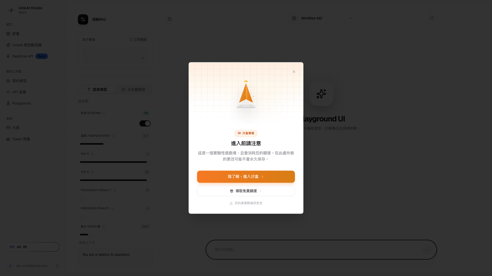
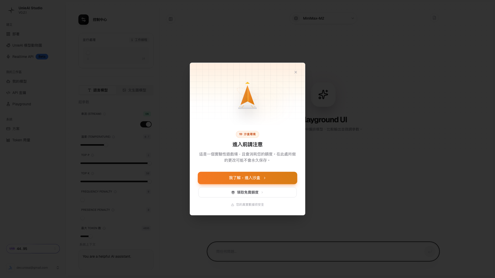
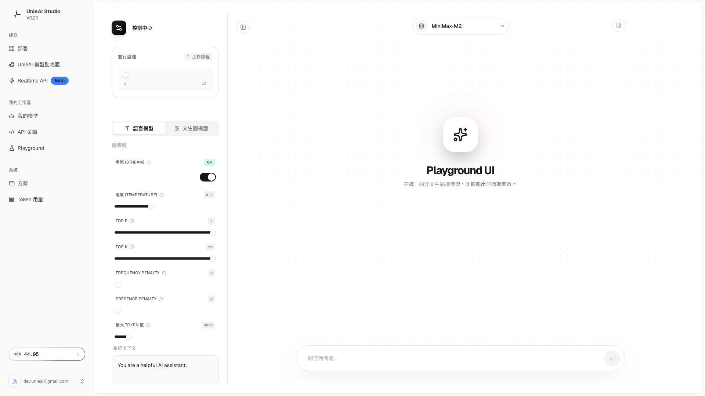
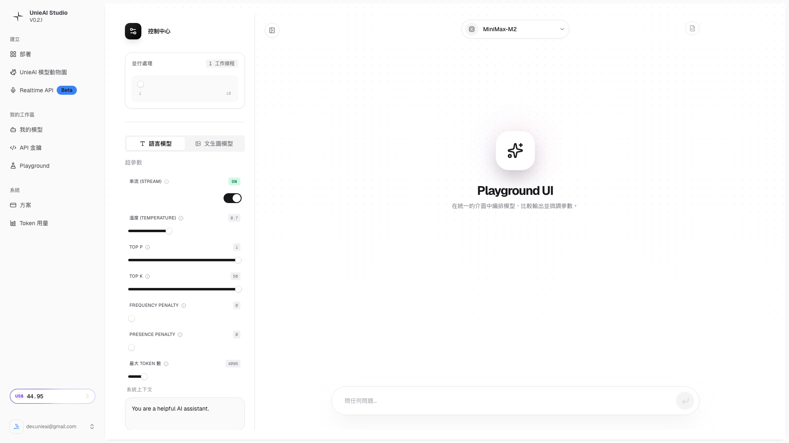

# UnieAI Studio 教學 - 第三章：Playground 專業測試環境

*🎮 進入專業 AI Playground：掌握 MiniMax-M2 等模型的測試環境*

---

## 📋 本章學習目標

完成本章後，你將能夠：
- ✅ 理解 Playground 的專業測試環境定位
- ✅ 正確處理沙盒警告對話框
- ✅ 熟悉 MiniMax-M2 等模型的選擇和測試
- ✅ 掌握專業參數控制 (Temperature、Top-P、Max tokens 等)
- ✅ 進行有效的對話測試和參數優化

**⏱️ 預估完成時間**: 30-40 分鐘  
**🎯 難度**: 中級 (需要一定技術背景)

---

## 🎮 第一節：Playground 功能定位

### 💡 什麼是 Playground？

Playground 是 UnieAI Studio 的專業 AI 測試環境：
- 🎮 **AI Playground/Studio** 開發者工具界面
- 🤖 **MiniMax-M2** 等專業 AI 模型選擇
- ⚙️ **完整生成參數控制** 微調能力
- 💬 **專業聊天測試** 環境
- 📊 **即時效果觀察** 和參數調整
- 🔬 **實驗性沙盒環境** 安全測試

### 🎯 Playground vs 其他功能比較

```
🏆 Playground 獨特價值:
專業開發者工具:
• 高級參數微調控制
• 即時效果觀察能力
• 多模型快速對比測試
• 專業測試環境

vs Model Zoo (模型瀏覽):
• Model Zoo: 模型選擇和瀏覽
• Playground: 深度測試和調試

vs Realtime API (API 測試):
• Realtime API: API 功能測試
• Playground: 參數效果測試

vs 部署環境:
• 部署: 生產環境配置
• Playground: 開發環境調試
```

### 📊 測試發現的界面元素

```
🧪 Playground 完整功能:
🤖 模型選擇區域:
• MiniMax-M2 等 AI 模型可選
• 下拉式專業模型選擇器

⚙️ 生成參數控制區域:
• Streaming: ON/OFF 切換
• Temperature: 創意度控制 (0.1-2.0)
• Top-P: 詞彙選擇機率 (0.1-1.0)
• Top-K: 硬限制參數 (1-1000)
• Frequency/Presence Penalty: 重複懲罰
• Max tokens: 最大輸出長度 (1-4096)

💬 聊天輸入區域:
• 底部專業聊天輸入框
• 支援即時對話測試
• 發送按鈕和 Enter 鍵支援
• 歷史對話記錄
```

---

## 🚀 第二節：進入 Playground

### 📍 訪問方法

```bash
🎮 訪問 Playground:
方法 1: 側邊欄點擊 "Playground"
方法 2: 直接訪問 https://studio.unieai.com/zh-TW/playground
方法 3: 從 Dashboard 導航進入
方法 4: 使用搜尋功能找到 Playground
```

### ⚠️ 重要：沙盒警告處理

#### 首次訪問時的警告對話框

當你第一次訪問 Playground 時，會出現一個重要的警告對話框：

##### A. 沙盒警告界面
  
*沙盒警告：首次訪問時必須確認的警告對話框*

**警告內容說明**：
- **標籤**: "沙盒環境"
- **標題**: "進入前請注意"
- **訊息**: "這是實驗性沙盒。使用將消費配額/積分，變更可能不會永久保存"

##### B. 確認按鈕懸停
  
*確認按鈕：橙色 "我了解，進入沙盒" 主要按鈕*

**操作按鈕說明**：
- **主要按鈕**: "我了解，進入沙盒" (橙色，帶陰影效果)
- **次要按鈕**: "領取免費額度" (可選，用於新用戶)

#### 沙盒警告處理流程

```
⚠️ Step-by-Step 處理流程:
1. 仔細閱讀警告內容
   • 了解這是實驗性環境
   • 確認會消費配額/積分
   • 了解變更不會永久保存

2. 評估風險和需求
   • 是否需要測試功能
   • 是否願意消費配額
   • 是否理解風險

3. 點擊主要確認按鈕
   • 點擊橙色 "我了解，進入沙盒"
   • 等待 5-8 秒進入真正界面
   • 不要點擊 "領取免費額度" (僅限新用戶)

4. 確認進入成功
   • 看到 MiniMax-M2 等模型選擇器
   • 界面載入完整參數控制區域
   • 可以開始專業測試
```

##### C. 確認後界面
  
*沙盒確認後：進入真正的 Playground 測試界面*

---

## 🎮 第三節：界面元素深度分析

### 📱 完整 Playground 界面

##### D. 最終 Playground 狀態
  
*完整 Playground：專業 AI 測試環境界面*

### 🤖 模型選擇區域

#### MiniMax-M2 模型
```
🎯 MiniMax-M2 特色:
• 類型: 大型語言模型
• 訓練: 專門優化的對話模型
• 語言支援: 支援中英文等多語言
• 能力: 通用對話、推理、創作
• 定位: 開發者專業測試模型
```

#### 模型選擇操作
```bash
🤖 選擇模型步驟:
1. 找到頂部的模型下拉選單
2. 點擊下拉箭頭展開選項
3. 瀏覽可用的模型列表
4. 選擇 MiniMax-M2 或其他模型
5. 確認選擇並等待載入
6. 觀察模型名稱顯示在選擇器中
```

### ⚙️ 生成參數控制

#### Streaming 功能
```
📺 Streaming 控制:
• 功能: 即時顯示 AI 回應
• 建議設定: ON (推薦)
• 優點:
  - 即時看到回應過程
  - 了解 AI 思考過程
  - 適合觀察參數影響
• 缺點:
  - 可能影響視覺連續性
  - 需要等待完整回應

• 關閉設定: 獲得完整回應後顯示
• 優點: 整潔的完整回應
• 缺點: 無法觀察生成過程
```

#### Temperature (創意度控制)
```
🌡️ Temperature 參數:
• 範圍: 0.1 - 2.0
• 功能: 控制回應的創意度和隨機性

建議設定:
• 0.1-0.3: 最保守回答，適合事實查詢
• 0.4-0.7: 平衡創造性和準確性 (推薦)
• 0.8-1.2: 高度創意，適合創作
• 1.3-2.0: 極高創意，風險較高

測試建議:
• 從 0.7 開始測試
• 根據結果調整高低
• 記錄最喜歡的設定
• 不同任務使用不同值
```

#### Top-P (核取樣)
```
🎯 Top-P 參數:
• 範圍: 0.1 - 1.0
• 功能: 控制詞彙選擇的機率累積

建議設定:
• 0.8-0.9: 保守選擇，專注核心詞彙 (推薦)
• 0.6-0.8: 適中選擇，平衡質量
• 0.9-1.0: 寬鬆選擇，增加多樣性

使用策略:
• 與 Temperature 配合使用
• Top-P = 0.9 配合 Temperature = 0.7 是安全組合
• 較高的 Top-P 增加創意但可能影響準確性
```

#### Top-K (硬限制)
```
🔢 Top-K 參數:
• 範圍: 1 - 1000
• 功能: 限制候選詞彙的數量

建議設定:
• 20-50: 限制候選，專注常見詞彙
• 50-100: 適中設定，平衡選擇 (推薦)
• 100-200: 寬鬆設定，增加多樣性
• 200+: 極寬鬆，創意最高但風險大

配合策略:
• 高 Temperature + 低 Top-K = 創意但穩定
• 低 Temperature + 高 Top-P = 準確但有限
```

#### Frequency/Presence Penalty
```
⚖️ Penalty 參數:
Frequency Penalty (重複懲罰):
• 範圍: -2.0 到 2.0
• 功能: 減少重複詞彙的使用
• 建議: 0.3-0.8

Presence Penalty (存在懲罰):
• 範圍: -2.0 到 2.0  
• 功能: 鼓勵新主題和新詞彙
• 建議: 0.2-0.6

使用場景:
• 長文本生成: 增加重複懲罰
• 創意內容: 增加存在懲罰
• 專業回答: 輕度懲罰或零
```

#### Max Tokens (最大長度)
```
📏 Max Tokens 控制:
• 範圍: 1 - 4096
• 功能: 控制回應的最大長度

建議設定:
• 50-150: 簡短回答
• 200-500: 詳細回答 (推薦)
• 500-1000: 長文本生成
• 1000+: 長文檔或完整分析

成本考量:
• 較少的 tokens = 較低成本
• 根據需求設定合理的上限
• 避免不必要的长回应
```

### 💬 聊天輸入區域

#### 輸入功能
```
💬 聊天輸入操作:
• 位置: 界面底部
• 功能: 文字輸入和發送
• 支援: Enter 鍵快捷發送
• 歷史: 保存對話記錄
• 格式化: 支援多行文字
```

#### 發送機制
```
📤 發送方式:
• 點擊發送按鈕
• 按 Enter 鍵
• Shift+Enter 換行
• 支援中文、英文、多語言
• 自動保存輸入歷史
```

---

## 🧪 第四節：專業測試實戰

### 📋 測試場景設計

#### 基礎功能測試
```
🎯 測試場景 1: 基礎對話
問題範例:
• "你好，請自我介紹並說明你的能力"
• "請解釋人工智能的基本概念"
• "什麼是機器學習？"

測試目標:
• 驗證模型基本功能
• 測試理解能力
• 評估回應品質
```

#### 專業能力測試
```
🎯 測試場景 2: 專業知識
問題範例:
• "分析比特幣的投資風險和機會"
• "解釋量子計算的原理和應用"
• "提供現代網站開發的最佳實踐"

測試目標:
• 評估專業知識深度
• 測試邏輯推理能力
• 驗證技術準確性
```

#### 創意能力測試
```
🎯 測試場景 3: 創意內容
問題範例:
• "寫一個關於未來城市的短篇故事"
• "設計一個環保商業計劃"
• "創作一首關於科技的詩"

測試目標:
• 測試創意和想像力
• 評估文字表達能力
• 觀察 Temperature 影響
```

#### 程式開發測試
```
🎯 測試場景 4: 程式編碼
問題範例:
• "用 Python 寫一個簡單的計算器"
• "解釋 REST API 的工作原理"
• "提供網站性能優化的建議"

測試目標:
• 測試程式碼理解能力
• 評估技術指導品質
• 驗證知識更新程度
```

### 🔧 參數調試實戰

#### Step 1: 基準測試
```bash
📊 基準設定:
1. 設定預設參數:
   • Temperature: 0.7
   • Top-P: 0.9
   • Top-K: 100
   • Frequency Penalty: 0.5
   • Presence Penalty: 0.3
   • Max Tokens: 500
   • Streaming: ON

2. 用同一問題測試:
   • 問題: "解釋機器學習的優缺點"
   • 記錄回應品質和特色
   • 記錄回應時間
```

#### Step 2: 參數調整測試
```bash
🔧 參數調整測試:
Temperature 調整:
• 測試 0.3 (保守)
• 測試 0.7 (平衡)
• 測試 1.2 (創意)
• 比較創意度和準確性

Top-P 調整:
• 測試 0.6 (保守)
• 測試 0.9 (平衡)
• 測試 1.0 (開放)
• 比較詞彙多樣性

Max Tokens 調整:
• 測試 150 (簡短)
• 測試 500 (適中)
• 測試 1000 (詳細)
• 比較內容完整性
```

#### Step 3: 場景優化
```bash
🎯 場景特定優化:
事實查詢場景:
• Temperature: 0.3-0.5
• Top-P: 0.8-0.9
• Max Tokens: 200-400

創意寫作場景:
• Temperature: 0.8-1.2
• Top-P: 0.9-1.0
• Presence Penalty: 0.5-0.8

程式編碼場景:
• Temperature: 0.2-0.5
• Frequency Penalty: 0.6-0.8
• Max Tokens: 300-800

分析研究場景:
• Temperature: 0.4-0.7
• Top-P: 0.8-0.9
• Max Tokens: 800-1500
```

### 📈 測試記錄和分析

#### 測試記錄表
```
📊 測試記錄格式:
日期: ___________
模型: MiniMax-M2
問題: ___________
參數:
  Temperature: ____
  Top-P: ____
  Top-K: ____
  Frequency Penalty: ____
  Presence Penalty: ____
  Max Tokens: ____

結果評分:
  準確性: ⭐⭐⭐⭐⭐
  創意度: ⭐⭐⭐⭐⭐
  清晰度: ⭐⭐⭐⭐⭐
  相關性: ⭐⭐⭐⭐⭐
  完整性: ⭐⭐⭐⭐⭐

回應時間: ____ 秒
成本估算: ____ tokens
改進建議: ___________
```

---

## 📋 第五節：實戰練習

### ✅ 練習項目

完成以下練習項目來確認你的理解：

#### 練習 1：沙盒警告處理
```
□ 進入 Playground 頁面
□ 仔細閱讀沙盒警告內容
□ 點擊 "我了解，進入沙盒" 按鈕
□ 等待界面載入完成
□ 確認看到專業參數控制區域
```

#### 練習 2：模型選擇操作
```
□ 找到模型選擇下拉選單
□ 選擇 MiniMax-M2 模型
□ 確認模型載入成功
□ 觀察模型名稱顯示
□ 測試切換不同模型 (如可用)
```

#### 練習 3：參數調整測試
```
□ 設定 Temperature = 0.7
□ 設定 Top-P = 0.9
□ 設定 Max Tokens = 500
□ 開啟 Streaming 模式
□ 測試預設參數的結果
```

#### 練習 4：對話測試
```
□ 輸入測試問題: "你好，請自我介紹"
□ 觀察 Streaming 模式的即時回應
□ 記錄回應品質和特色
□ 測試不同參數的影響
□ 建立參數效果比較表
```

### 🔍 問題診斷

#### 常見問題
```
❌ 問題: 沙盒警告無法點擊
💡 解決: 檢查網路連接，刷新頁面重試

❌ 問題: 模型選擇器無法載入
💡 解決: 等待頁面完全載入，檢查帳戶狀態

❌ 問題: 參數調整無效果
💡 解決: 確認已保存設定，重新發送問題

❌ 問題: Streaming 模式卡住
💡 解決: 關閉 Streaming，獲得完整回應

❌ 問題: 回應品質不佳
💡 解決: 調整 Temperature 和 Top-P 參數
```

---

## 📊 第六節：成本管理

### 💰 沙盒環境成本考量

#### 成本警告理解
```
💸 沙盒警告解讀:
• "使用將消費配額/積分"
  - 每次 API 調用都會消耗成本
  - 即使是測試也會計費
  - 成本與 Token 使用量成正比

• "變更可能不會永久保存"
  - 測試結果和對話歷史可能不會永久保存
  - 建議重要測試結果需要自行記錄
  - 不要依賴平台保存測試數據
```

#### 成本控制策略
```
💡 成本控制方法:
測試策略:
• 使用簡短問題進行參數測試
• 控制 Max Tokens 限制
• 避免重複測試相同問題
• 記錄最佳參數組合

參數優化:
• 從保守設定開始
• 逐步調整參數
• 每次只調整一個參數
• 記錄成本效益比

監控方法:
• 記錄每次測試的 Token 使用量
• 監控累積成本
• 設定預算限制提醒
• 定期審查使用模式
```

### 📊 成本效益分析

#### 測試成本評估
```
💰 成本計算範例:
短測試 (100 tokens): ~$0.002
中測試 (500 tokens): ~$0.01
長測試 (1000 tokens): ~$0.02

優化節省:
• 正確參數設定可節省 20-40% 成本
• 減少不必要的長回應
• 優化 Max Tokens 限制
• 合理使用 Streaming 功能
```

---

## 📚 第七節：下一步學習

### 🎯 準備進入下一章

完成本章練習後，你應該已經：
- ✅ 成功處理沙盒警告並進入 Playground
- ✅ 熟悉 MiniMax-M2 等專業模型選擇
- ✅ 掌握所有生成參數的調整方法
- ✅ 進行了有效的對話測試
- ✅ 理解了成本控制的重要性

### 📖 下一章預覽

**第四章：部署創建詳解**
- 部署流程和參數配置
- FinanceLLM (Beta) 實際選擇操作
- Token 限制和自動擴展設定
- 部署後管理概念

### 💡 學習建議

```
🎯 Playground 使用建議:
• 熟練使用後再進入部署階段
• 記錄最佳的參數組合
• 建立標準化的測試流程
• 定期優化參數設定
• 注意成本控制
```

---

## ✅ 本章檢查清單

完成本章學習後，請確認：

```
📋 Playground 入門檢查清單:
□ 成功處理沙盒警告對話框
□ 進入真正的 Playground 測試界面
□ 熟悉 MiniMax-M2 模型選擇
□ 掌握所有生成參數的調整方法
□ 完成基礎、專業、創意測試場景
□ 建立參數優化的測試流程
□ 理解成本控制策略
□ 記錄最佳參數組合
□ 準備進入第四章學習
```

---

## 📞 獲得幫助

### 🆘 常見問題
```
❓ 沙盒警告是否必須確認
💡 是的，必須確認才能進入 Playground

❓ 如何記錄最佳參數
💡 建立測試記錄表，定期分析結果

❓ Playground 和部署環境有什麼區別
💡 Playground 是測試環境，部署是生產環境

❓ 如何控制測試成本
💡 使用簡短問題，設定 Token 限制
```

### 📚 參考資源
```
📖 有用資源:
• Playground 官方說明文檔
• 參數調整最佳實踐
• 成本控制策略指南
• AI 對話測試案例庫
• 社群參數優化討論
```

---

**🎊 恭喜完成第三章學習！你現在已經掌握了專業 Playground 測試環境的使用方法。**

**準備好進入第四章：部署創建詳解**

---

**由 DotDot Max ✨ 編撰**  
*專業 AI 測試環境指南 | 2026-01-29*