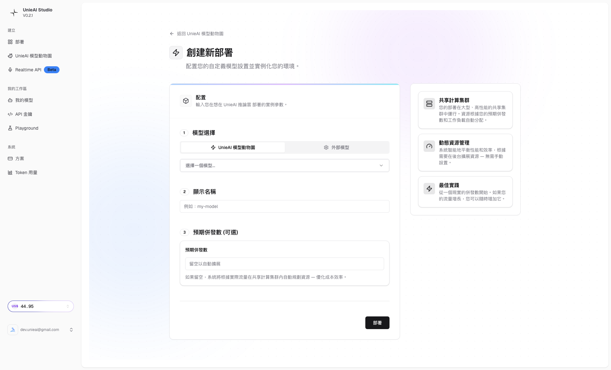

# UnieAI Studio 教學 - 第四章：部署創建詳解

*🚀 掌握模型部署：從選擇到創建的完整流程*

---

## 📋 本章學習目標

完成本章後，你將能夠：
- ✅ 理解模型部署的概念和流程
- ✅ 掌握部署表單的填寫方法
- ✅ 成功選擇和配置 AI 模型
- ✅ 設定合理的 Token 限制和參數
- ✅ 啟用自動擴展功能
- ✅ 理解部署成本和監控

**⏱️ 預估完成時間**: 35-45 分鐘  
**🎯 難度**: 中級 (需要技術理解)

---

## 🚀 第一節：部署概念介紹

### 💡 什麼是模型部署？

模型部署是將 AI 模型從測試環境轉換為生產環境的過程：

```
🎯 部署的價值:
• 從測試到生產 - Playground 測試 → API 服務
• 持久化服務 - 24/7 可用的 AI 服務
• API 化接口 - 程式化調用和管理
• 資源分配 - 專用的計算資源
• 監控和管理 - 使用量統計和成本控制
• 安全和穩定 - 生產級別的可靠性
```

### 🆚 部署 vs 測試環境比較

| 功能特色 | Playground 測試 | 部署生產環境 |
|---------|------------------|--------------|
| **目的** | 實驗和調試 | 生產服務 |
| **穩定性** | 實驗性，會變動 | 穩定，版本控制 |
| **資源** | 共享資源 | 專用資源 |
| **管理** | 無管理界面 | 完整管理工具 |
| **成本** | 按使用計費 | 專用計費 |
| **可用性** | 實驗時間限制 | 24/7 服務 |
| **API** | 無 API | 完整 API 端點 |

### 📊 部署生態系統

```
🌐 完整部署生態:
🤖 部署層級:
• 模型選擇 - 從 Model Zoo 選擇模型
• 資源配置 - CPU、記憶體、併發數
• API 端點 - 標準 REST API 服務
• 監控系統 - 使用量和性能監控
• 成本管理 - 透明計費和預算控制
```

---

## 📁 第二節：進入部署創建

### 🎯 訪問方法

```bash
🚀 訪問創建部署:
方法 1: Dashboard 點擊 "創建部署" 按鈕
方法 2: 直接訪問 https://studio.unieai.com/create
方法 3: 從 Model Zoo 選擇模型後進入
方法 4: 從 "我的模型" 點擊 "新建部署"
```

### 📱 創建部署界面導覽

#### 部署表單結構
```
📋 創建部署表單元素:
1. 頂部導航區
   • 頁面標題和描述
   • 進度指示器
   • 幫助連結

2. 模型選擇區
   • 模型搜索和選擇器
   • 模型詳細資訊顯示
   • 模型狀態和可用性

3. 配置參數區
   • Token 限制設定
   • 併發數配置
   • 資源分配選項

4. 高級設定區
   • 自動擴展選項
   • 安全設定
   • 監控配置

5. 確認和提交區
   • 配置摘要
   • 成本預估
   • 部署按鈕
```

---

## 🤖 第三節：模型選擇操作

### 🔍 Step 1：模型搜索和選擇

#### 模型選擇器
```
🎯 選擇操作流程:
1. 點擊模型選擇按鈕
   • 位置: 表單頂部
   • 類型: 下拉選單或搜索框
   • 功能: 搜索和篩選模型

2. 瀏覽可用模型
   • 顯示所有可部署的模型
   • 包含模型名稱、版本、狀態
   • 支援搜索和篩選

3. 選擇合適模型
   • 根據用途選擇模型
   • 確認模型狀態為 "可用"
   • 查看模型詳細資訊
```

### 📸 選擇過程截圖

#### A. 初始部署表單
  
*初始表單：顯示模型選擇器和基本配置*

**界面說明**：
- **表單頂部**: 模型選擇器
- **配置區域**: Token 限制和自動擴展
- **操作區域**: 部署按鈕

#### B. 模型下拉選單
  
*模型下拉選單：35+ 個模型選項可用*

**選項分析**：
- **可用模型數量**: 35+ 個模型
- **模型類型**: 對話、代碼、圖像、音頻
- **狀態標示**: 可用、Beta、實驗性
- **搜索功能**: 支援關鍵字搜索

#### C. 已選擇模型
  
*已選擇 FinanceLLM (Beta)：確認模型選擇成功*

**確認要素**：
- **模型名稱**: FinanceLLM (Beta)
- **選擇狀態**: 已選中並確認
- **模型資訊**: 版本和狀態顯示

### 🤖 FinanceLLM (Beta) 選擇分析

#### 為什麼選擇 FinanceLLM (Beta)？
```
💼 FinanceLLM 優勢:
專業金融領域:
• 金融市場分析
• 投資策略建議
• 風險評估
• 經濟指標解讀

技術特色:
• 中文語言支援
• 專業術語理解
• 數據分析能力
• 實時資訊整合

應用場景:
• 個人投資理財
• 金融機構諮詢
• 教育培訓內容
• 市場研究報告
```

#### Beta 版本考量
```
⚠️ Beta 版本注意事項:
✅ 優勢:
• 最新的 AI 技術體驗
• 免費或優惠價格
• 快速功能和修復
• 直接反饋管道

⚠️ 風險:
• 功能可能不穩定
• 支援回應較慢
• 可能突然更新
• 不建議重要生產環境使用

建議使用場景:
• 個人項目和學習
• 非關鍵業務測試
• 創新功能嘗試
• 社群項目開發
```

---

## ⚙️ 第四節：配置參數設定

### 📊 Step 2：Token 限制配置

#### Token 限制的作用
```
📏 Token 限制重要性:
成本控制:
• 限制每次 API 調用的最大成本
• 防止意外的長回應消耗
• 設定使用預算上限

質量保證:
• 確保回應的聚焦性
• 避免過度詳細的回答
• 維持對話的相關性

性能優化:
• 減少回應時間
• 降低伺服器負載
• 提高系統穩定性
```

#### Token 限制建議
```
🎯 場景特定的 Token 設定:
簡短對話 (50-150 tokens):
• 用戶: 日常問答、簡單查詢
• 建議: 150-300 tokens
• 成本: 低 (~0.003-0.006)

中等對話 (200-500 tokens):
• 用戶: 詳細解釋、分析報告
• 建議: 500-1000 tokens
• 成本: 中等 (~0.01-0.02)

長文內容 (600-1500 tokens):
• 用戶: 創作文檔、研究報告
• 建議: 1500-2000 tokens
• 成本: 高 (~0.03-0.04)

技術文檔 (1000+ tokens):
• 用戶: 程式碼生成、技術分析
• 建議: 2000-3000 tokens
• 成本: 很高 (~0.04-0.06)
```

### 🔧 Step 3：自動擴展配置

#### 自動擴展功能
```
⚙️ 自動擴展說明:
功能描述:
• "留空以自動擴展"
• 系統根據需求自動分配資源
• 動態調整計算能力
• 優化性能和成本平衡

優點:
• 無需手動資源管理
• 適應流量變化
• 自動故障恢復
• 成本效益優化

適用場景:
• 不確定使用量的新專案
• 流量變化較大的應用
• 希望降低管理成本的用戶
• 追求穩定性和可靠性
```

#### 手動配置選項
```
🔧 手動資源設定 (如可用):
CPU 配置:
• 基礎: 1-2 核心
• 標準: 4-8 核心
• 高性能: 16+ 核心

記憶體配置:
• 基礎: 2-4 GB
• 標準: 8-16 GB
• 高性能: 32+ GB

併發數設定:
• 小型: 1-5 併發
• 中型: 10-50 併發
• 大型: 100+ 併發
```

### 🎯 Step 4：其他配置選項

#### 併發限制
```
🔢 併發配置:
定義:
• 同時處理的最大請求數
• 影響系統吞吐量和響應時間
• 與成本成正比

建議設定:
• 小型應用: 1-5 併發
• 中型應用: 10-20 併發
• 大型應用: 50+ 併發
• 高流量應用: 100+ 併發
```

#### 冷啟動時間
```
⏰ 冷啟動設定:
概念:
• 模型從休眠到啟動的時間
• 影響用戶等待體驗
• 與資源分配相關

優化策略:
• 設置最小併發保持熱啟
• 使用預熱請求
• 優化部署配置
```

---

## 💰 第五節：成本評估和預算

### 💸 成本結構分析

#### 部署成本組成
```
💰 成本構成:
固定成本:
• 基礎部署費用
• 模型使用費
• 基礎資源費

變動成本:
• Token 使用量費
• 併發使用費
• 資料傳輸費

隱藏成本:
• 監控和分析
• 備份和存儲
• 安全和合規
```

#### 成本計算範例
```
📊 FinanceLLM 成本範例:
小型部署:
• 併發數: 5
• Token 限制: 500
• 月使用量: 10,000 次調用
• 月成本: $15-30

中型部署:
• 併發數: 20
• Token 限制: 1000
• 月使用量: 50,000 次調用
• 月成本: $75-150

大型部署:
• 併發數: 100
• Token 限制: 2000
• 月使用量: 200,000 次調用
• 月成本: $300-600
```

### 📊 成本優化策略

#### 參數優化
```
💡 成本節省方法:
Token 優化:
• 設定合理的 Max Tokens
• 優化提示詞長度
• 使用分段處理長內容
• 實施回應截斷

併發優化:
• 根據實際需求設定
• 使用連接池技術
• 實施請求排隊
• 監控併發使用率

模型選擇:
• 選擇性價比高的模型
• 根據用途選擇合適模型
• 實施模型路由
• 定期評估模型效果
```

#### 使用模式優化
```
🎯 使用優化策略:
請求優化:
• 合併相關請求
• 實施請求緩存
• 使用批次處理
• 優化錯誤處理

監控策略:
• 設定使用警報
• 定期成本審查
• 分析使用模式
• 實施預算控制
```

---

## 📋 第六節：實戰部署流程

### 🎯 Step 1：準備工作

#### 部署前檢查清單
```
✅ 部署前準備:
□ 明確應用需求和使用場景
□ 選擇合適的 AI 模型
□ 評估預算和成本控制
□ 確認技術架構需求
□ 準備測試和驗證計劃
□ 建立監控和警報機制
```

#### 模型選擇決策
```
🎯 決策框架:
需求分析:
• 主要用途: 對話、分析、生成
• 語言需求: 中文、英文、多語言
• 品質要求: 標準、高品質
• 響應時間: 快速、標準
• 成本預算: 限制、彈性

模型評估:
• 功能適配度 (30%)
• 品質和準確性 (25%)
• 成本效益 (20%)
• 穩定性和支援 (15%)
• 開發便利性 (10%)
```

### 🚀 Step 2：執行部署

#### 詳細操作步驟
```bash
📋 Step-by-Step 部署流程:

1. 進入創建部署頁面
   • 點擊 Dashboard "創建部署"
   • 或訪問 /create 直接進入

2. 選擇 AI 模型
   • 點擊模型選擇器
   • 搜索或瀏覽 FinanceLLM (Beta)
   • 確認模型狀態為 "可用"
   • 點擊選擇並確認

3. 設定基本參數
   • 設定 Max Tokens (建議 500-1000)
   • 確認自動擴展狀態
   • 設定併發數限制 (建議 5-10)

4. 檢查配置摘要
   • 確認所有設定正確
   • 檢查預估成本
   • 閱讀服務條款

5. 執行部署
   • 點擊 "創建部署" 按鈕
   • 等待部署完成 (2-5 分鐘)
   • 確認部署狀態
   • 獲得 API 端點
```

#### 部署狀態追蹤
```
📊 部署狀態說明:
部署中:
• 狀態: 橙色或黃色指示器
• 時間: 2-5 分鐘
• 操作: 耐心等待，勿重複點擊

部署成功:
• 狀態: 綠色指示器
• 功能: API 端點可用
• 通知: 郵件或站内通知

部署失敗:
• 狀態: 紅色指示器
• 原因: 資源不足、配置錯誤
• 操作: 檢查錯誤訊息，調整配置
```

### 📸 部署流程截圖

#### D. 準備部署
  
*準備部署：所有配置完成，等待確認*

#### E. 完整填寫
  
*完整表單：最終填寫狀態確認*

---

## 📊 第七節：部署後管理

### 🛠️ 部署管理功能

#### "我的模型" 管理
```
📁 管理功能:
查看部署:
• 模型列表和狀態
• 部署時間和使用統計
• API 端點資訊
• 配置參數

管理操作:
• 暫停/恢復部署
• 調整參數設定
• 升級模型版本
• 刪除不需要的部署
• 查看使用日誌
```

#### 使用統計和監控
```
📈 監控指標:
使用量統計:
• API 調用次數
• Token 使用量
• 回應時間
• 成功率

成本追蹤:
• 每日/週/月成本
• 成本趨勢分析
• 成本效益比
• 預算使用率

性能監控:
• 響應時間分佈
• 錯誤率
• 可用性
• 併發使用率
```

### 📋 部署維護

#### 定期維護任務
```
🔧 維護檢查清單:
每日檢查:
□ 查看使用統計
□ 監控成本變化
□ 檢查錯誤日誌
□ 確認系統可用性

週度檢查:
□ 分析使用模式
□ 優化參數設定
□ 評估成本效益
□ 檢查資源使用

月度檢查:
□ 全面成本審查
□ 模型效果評估
□ 升級需求評估
□ 最佳實踐更新
```

#### 性能優化
```
⚡ 優化策略:
響應時間優化:
• 優化提示詞設計
• 調整模型參數
• 實施請求緩存
• 優化網路配置

成本優化:
• 調整 Max Tokens
• 實施請求壓縮
• 優化使用模式
• 選擇合適併發數

品質優化:
• 持續測試和調整
• 用戶反饋收集
• 模型版本更新
• 提示詞優化
```

---

## 🛠️ 第八節：實戰練習

### ✅ 練習項目

完成以下練習項目來確認你的理解：

#### 練習 1：部署流程操作
```
□ 進入創建部署頁面
□ 搜索並選擇 FinanceLLM (Beta) 模型
□ 設定 Max Tokens = 800
□ 確認自動擴展功能啟用
□ 檢查配置摘要
```

#### 練習 2：參數優化設定
```
□ 根據用途調整 Token 限制
□ 設定合理的併發數
□ 啟用自動擴展
□ 計算預估成本
□ 記錄配置決策理由
```

#### 練習 3：成本評估
```
□ 使用成本計算器
□ 設定使用量預估
□ 計算月度和年度成本
□ 制定成本控制策略
□ 設定預算警報
```

#### 練習 4：部署後驗證
```
□ 確認部署狀態為 "運行中"
□ 獲得 API 端點資訊
□ 測試 API 調用
□ 查看使用統計
□ 建立監控檢查清單
```

### 🔍 問題診斷

#### 常見部署問題
```
❌ 問題: 部署失敗
💡 解決: 檢查模型可用性、網路連接、帳戶餘額

❌ 問題: 模型選擇不可用
💡 解決: 確認帳戶權限，聯繫支援

❌ 問題: 成本超出預期
💡 解決: 檢查參數設定，實施成本控制

❌ 問題: API 調用失敗
💡 解決: 確認端點 URL，檢查認證

❌ 問題: 回應品質不佳
💡 解決: 調整模型參數，優化提示詞
```

---

## 📚 第九節：下一步學習

### 🎯 準備進入下一章

完成本章練習後，你應該已經：
- ✅ 理解部署的概念和價值
- ✅ 掌握完整的部署流程
- ✅ 成功創建了第一個模型部署
- ✅ 理解成本控制的重要性
- ✅ 建立部署管理的基礎知識

### 📖 下一章預覽

**第五章：API 金鑰管理**
- API 金鑰的重要性和安全機制
- 創建和管理 API 金鑰
- 權限範圍設定和安全管理
- 使用情況監控和輪換

### 💡 學習建議

```
🎯 部署最佳實踐:
• 從小型部署開始測試
• 建立完整的監控機制
• 定期評估成本效益
• 持續優化配置參數
• 準備故障恢復計劃
```

---

## ✅ 本章檢查清單

完成本章學習後，請確認：

```
📋 部署創建詳解檢查清單:
□ 理解部署概念和部署 vs 測試的區別
□ 熟悉創建部署頁面的界面和功能
□ 成功選擇 FinanceLLM (Beta) 模型
□ 設定合理的 Token 限制和併發數
□ 啟用自動擴展功能
□ 理解成本結構和優化策略
□ 完成實際部署操作
□ 建立部署後管理計劃
□ 準備進入第五章學習
□ 記錄部署配置和決策依據
```

---

## 📞 獲得幫助

### 🆘 常見問題
```
❓ 如何選擇合適的 Token 限制
💡 根據應用場景，從 500-1000 開始測試

❓ 自動擴展和手動配置有什麼區別
💡 自動擴展更簡單但成本可能較高

❓ 部署後可以修改配置嗎
💡 大部分參數可以調整，部分需要重新部署

❓ 如何控制部署成本
💡 設定 Token 限制、併發限制，使用監控
```

### 📚 參考資源
```
📖 有用資源:
• 部署配置最佳實踐
• 成本計算器和工具
• 模型性能比較報告
• 部署案例研究
• 社群經驗分享
```

---

**🎊 恭喜完成第四章學習！你現在已經掌握了完整的模型部署流程。**

**準備好進入第五章：API 金鑰管理**

---

**由 DotDot Max ✨ 編撰**  
*模型部署專家指南 | 2026-01-29*